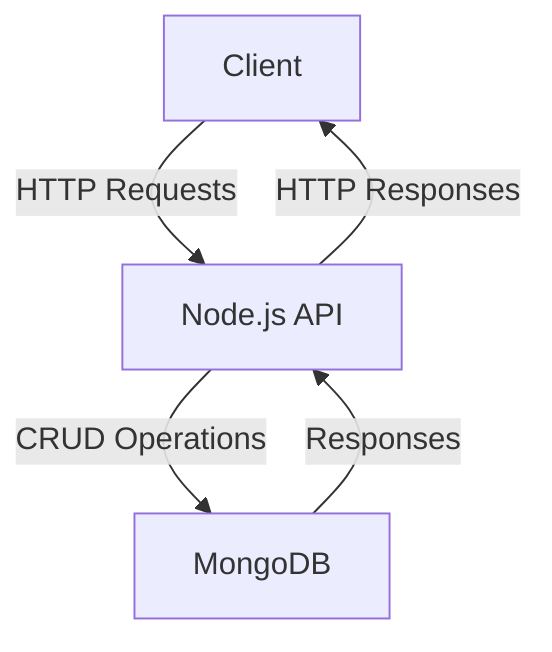
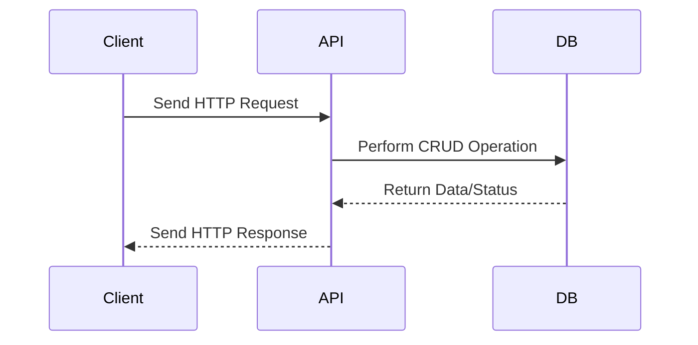

# Sample Node.js Application

This document provides an overview of a sample Node.js application, including its architecture and workflow. Mermaid diagrams are used to visualize the application's structure and processes.

## Application Overview

The sample Node.js application is a RESTful API that performs CRUD operations on a database. It uses the following technologies:

- **Node.js**: JavaScript runtime for building the application.
- **Express.js**: Web framework for handling HTTP requests.
- **MongoDB**: NoSQL database for data storage.

## Architecture Diagram



## Workflow Diagram



## Key Features

1. **Endpoints**:
   - `GET /items`: Fetch all items.
   - `POST /items`: Create a new item.
   - `PUT /items/:id`: Update an existing item.
   - `DELETE /items/:id`: Delete an item.

2. **Middleware**:
   - Input validation using `express-validator`.
   - Error handling for consistent API responses.

3. **Database**:
   - MongoDB collections for storing application data.
   - Mongoose for schema modeling and database interaction.

## Getting Started

1. Clone the repository:
   ```bash
   git clone https://github.com/your-repo/sample-nodejs-app.git
   cd sample-nodejs-app
   ```

2. Install dependencies:
   ```bash
   npm install
   ```

3. Start the application:
   ```bash
   npm start
   ```

4. Access the API at `http://localhost:3000`.

## References

- [Node.js Documentation](https://nodejs.org/en/docs/)
- [Express.js Guide](https://expressjs.com/)
- [MongoDB Documentation](https://www.mongodb.com/docs/)
- [Mermaid Documentation](https://mermaid-js.github.io/mermaid/)
